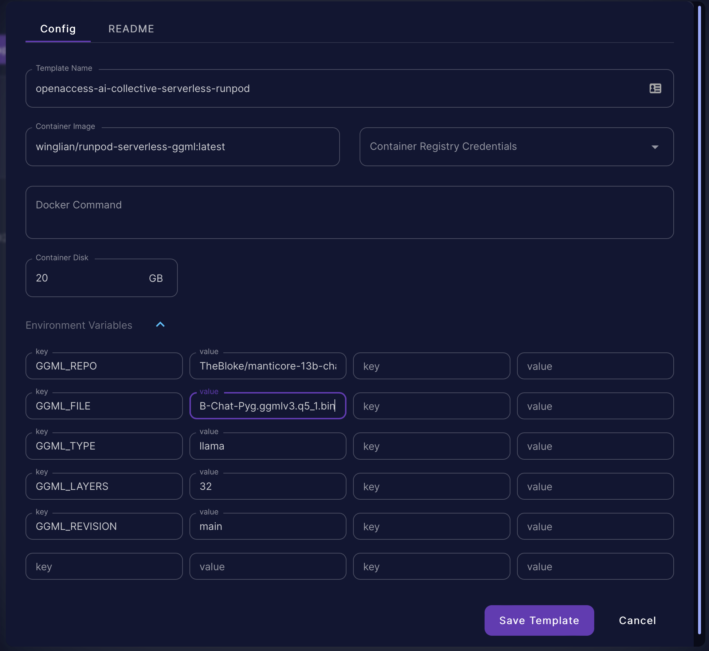
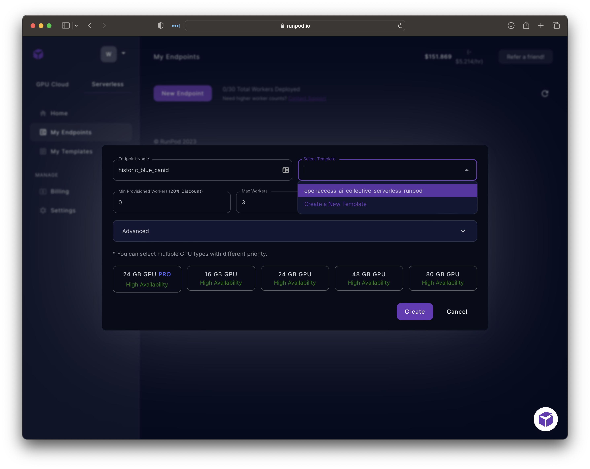
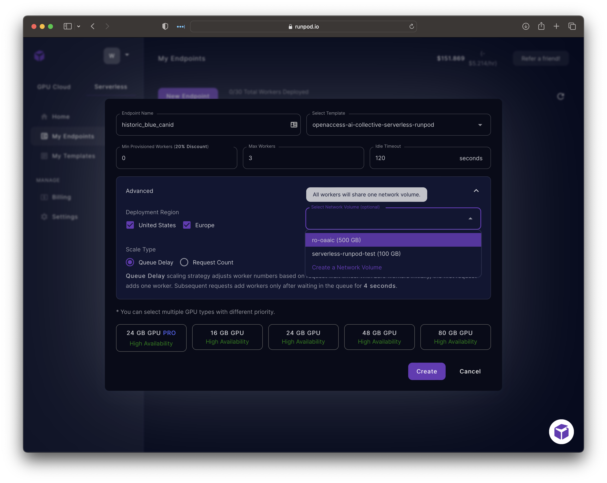
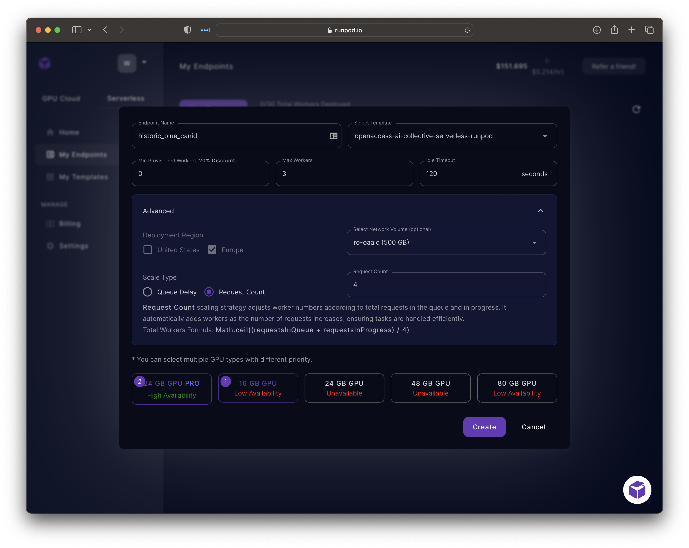
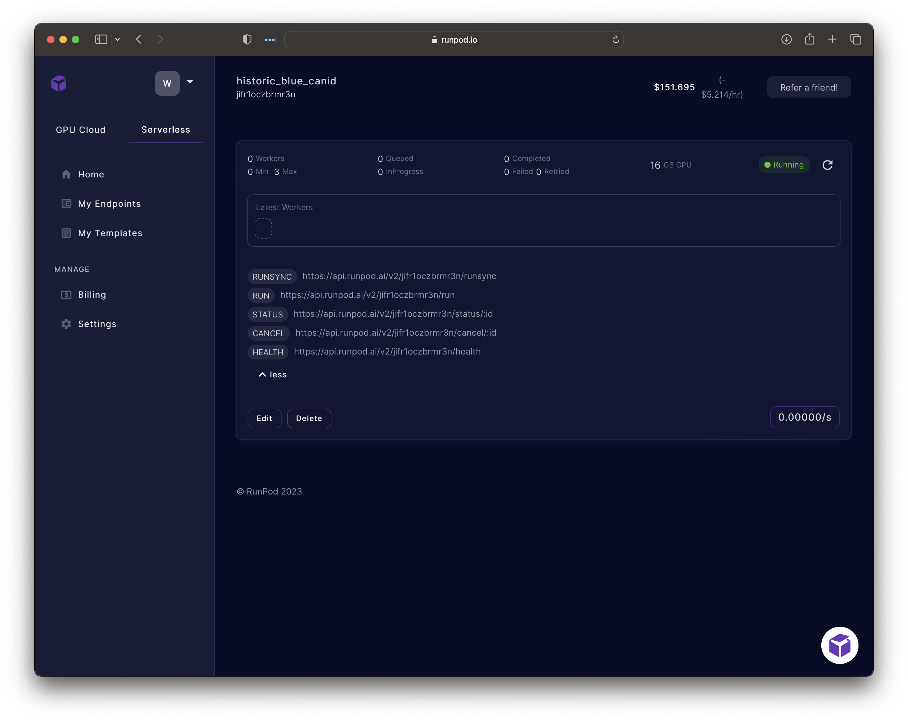

# servereless-runpod-ggml

## What is this?

You can now run your GGML language models using serverless workers from Runpod. For most people, this options will cost pennies per day
for general testing workloads. Simply upload your quantized model to HF, create a template & endpoint in Runpod, and 
you're ready to start testing your language model.

## Deploying with Runpod

- First, you'll need to add a [new serverless template](https://www.runpod.io/console/serverless/user/templates)
- The important fields are:
  - Container Image: `winglian/runpod-serverless-ggml:latest` 
  - Container Disk: Give it about 20GB of disk, more won't hurt.
  - Environment Variables: This is where you setup which HF repos and files the template will serve up
    - `GGML_REPO`, the HF repo that the quantized GGML file can be located. It's probably one by [TheBloke](https://huggingface.co/TheBloke)
    - `GGML_FILE`, the individual GGML bin file
    - `GGML_TYPE`, usually `llama`, remember to check [ctransformers](https://github.com/marella/ctransformers#supported-models) for supported types
    - `GGML_LAYERS`, the number of hidden layers to load into VRAM. Check your models `config.json` to get the correct values. 13B LlaMa has 40 hidden layers
    - `GGML_REVISION`, typically `main`, but if you want to use a specific commit version of a file, this is where you set the git SHA
<details>


</details>

- Next, create a [new serverless endpoint](https://www.runpod.io/console/serverless/user/endpoints)
- Select Template: Choose the template you created in the previous step
- Min Provisioned Workers: number of workers to keep warm to prevent cold starts. You can set this to 1+, but you'll be charged for it even if it goes unused. Recommended Value: 0
- Max Workers: if you have more requests than workers, they will get queued up
- Idle Timeout: how quickly a worker is terminated once the inference queue is idle. Setting too small of a value here will lead to frequent cold starts. 
- Advanced:
  - Deployment Region: you MUST choose Europe (Romania) for this. This requires network volumes to keep the models cached locally. Although Runpod supports netwrok volumes in the US, they have no GPU capacity in the Kansas data center where that feature is available.
  - Select Network Volume: create a network volume if you don't already have one. This can be shared across multiple endpoints with different models, so this should probably be large enough for your needs. 50GB to 100GB should be large enough.
  - Queue Delay: choose Request Count here. because inference can take at least 30 seconds in most cases, using queue delay will simply ramp up to all your max workers quickly, whereas Requests Count will be a bit more balanced
  - When choosing GPU types, try to use the smallest amount of VRAM that you model will fit in. 13B models should fit in 16GB of VRAM. Going higher to the 24GB pro will cost almost twice as much without significant performance increases. But go ahead and select at least two to ensure you have available capacity

<details>



</details>
<details>



</details>
<details>



</details>

- Once you've created your endpoint, you can view the details to get the endpoints' URLs.
<details>


</details>

- Create an [API Key](https://www.runpod.io/console/serverless/user/settings), you'll need to use this to auth to your endpoints
- Make sure to protect this key. It gives access to your entire runpod account. Unfortunately they don't have scoped API keys. Yet.
- Use your favorite tool to send a test request to your endpoint. Please note that the intiial request will take up to serveral minutes to complete as the worker needs to download the complete model to the network volume.

```http request
POST https://api.runpod.ai/v2/<put your endpoint id here>/run
Authorization: Bearer <redacted - put your api key here>
Content-Type: application/json; charset=utf-8

{
  "input": {
      "prompt": "The following is a chat between a USER and a helpful ASSISTANT.\nUSER: Tell me about the Minotaur. \nASSISTANT:",
      "stream": false
  }
}

HTTP/1.1 200 OK
Date: Sat, 03 Jun 2023 05:21:08 GMT
Content-Type: application/json; charset=utf-8

{
  "id": "c8231ef5-b969-4854-94d3-3f70ede17ce5",
  "status": "IN_QUEUE"
}
```

- You will need to use the id provided to poll for the inference prediction like so:
```http request
GET https://api.runpod.ai/v2/jifr1oczbrmr3n/stream/c8231ef5-b969-4854-94d3-3f70ede17ce5
Authorization: Bearer <redacted - put your api key here>

HTTP/1.1 200 OK
Date: Sat, 03 Jun 2023 05:22:48 GMT
Content-Type: application/json

{
  "status": "IN_PROGRESS",
  "stream": []
}
```

- when the inference job is completed, you should get a response like:
```http request
HTTP/1.1 200 OK
Date: Sat, 03 Jun 2023 05:23:54 GMT
Content-Type: application/json

{
  "status": "COMPLETED",
  "stream": [
    {
      "output": " The minotaur is one of Greek mythology's most famous monsters. He was a creature with the body of a bull and the head of a man, often depicted as having a human torso but the hindquarters of a bull. He was born to the god Poseidon and his human wife Pasiphaë, who lived on the island of Crete.\n\nThe minotaur was kept in a labyrinth designed by the architect Daedalus at the request of King Minos. The labyrinth had many twists and turns that made it impossible to navigate without getting lost. Once every nine years, seven young men and women were sacrificed as offerings to the beast.\n\nTheseus, a Greek hero who set out on his first journey, learned of this sacrifice from King Aegeus, his father. He volunteered to go to Crete and defeat the minotaur and return victorious or perish in the attempt. On arriving at Crete, Theseus was told by Ariadne, daughter of Minos, that he could kill the minotaur if he used a ball of thread given to him by her.\n\nTheseus followed the thread"
    }
  ]
}
```

## Demo

We've built demo space over on HuggingFace Spaces. We can use HF Spaces to serve the UI on a FREE CPU container, and 
that container can queue requests over to Runpod Endpoints. The downside compared to native HF GGML Spaces that we've 
provided before is that due to the queueing nature of Runpod Serverless, the UI will seem unresponsive since it has to 
wait for the complete response to be predicted, rather than being able to stream tokens as they are generated.

Our HF Spaces demo for this is available at [https://huggingface.co/spaces/openaccess-ai-collective/ggml-runpod-ui](https://huggingface.co/spaces/openaccess-ai-collective/ggml-runpod-ui),
feel free to Duplicate the space, and modify the config.yml to point to your endpoint. In your Space Settings,
there is a section for **Repository secrets**. There you will need to add a secret key called `RUNPOD_AI_API_KEY` 
with your previously created runpod api key.


## Building (contributors/dev only)

- build the base docker image to get the ctransformers wheels. This doesn't need to be done ofter. 
```shell
docker build -t winglian/runpod-serverless-ggml-base:latest . -f Dockerfile-base
```


- rebuild the primary docker image. This is the image we'll use with Runpod.
```shell
docker build -t winglian/runpod-serverless-ggml:latest .
docker push winglian/runpod-serverless-ggml:latest
``` 

## Roadmap

There is a lot of room for automation here. It should be possible using Runpod's APIs to remove all the pointing and clicking 
to create templates, endpoints, etc.

## Need help? 🙋‍♂️

Join our [Discord server](https://discord.gg/HhrNrHJPRb) where we can help you
